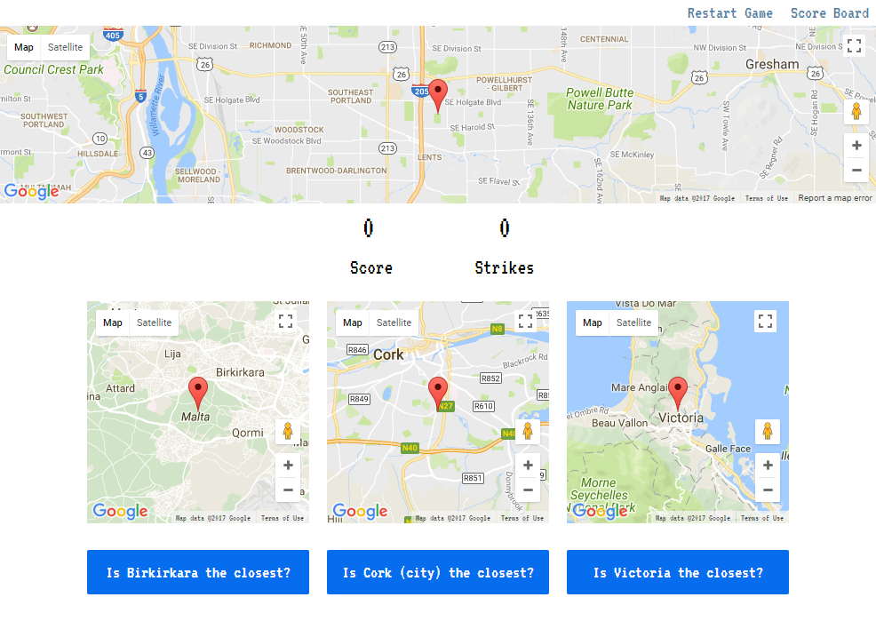
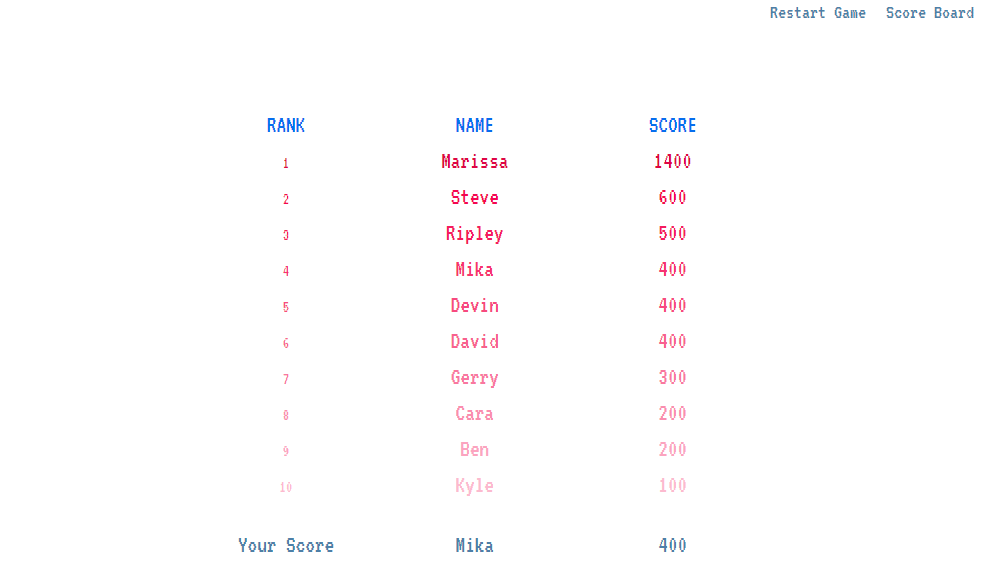

# React Game - Closest City
Guess which city is closest to your current location.

User is presented with 3 random cities and prompted to guess which is closest to their current location. After 3 incorrect answers they are prompted to enter their name. Their score is saved to the database and then the top scores are displayed.

[Server Side Code](https://github.com/krothenbaum/map-game-server)

Technology used:
* HTML/CSS
* JavaScript
* React
* Redux
* Node.js
* Express.js
* MongoDB
